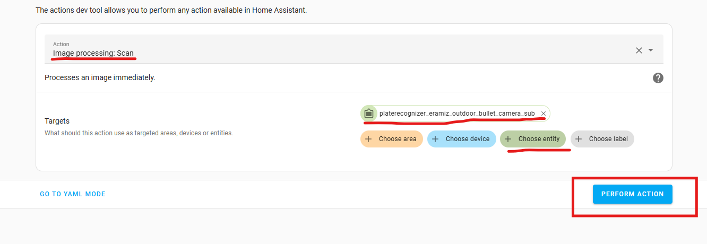
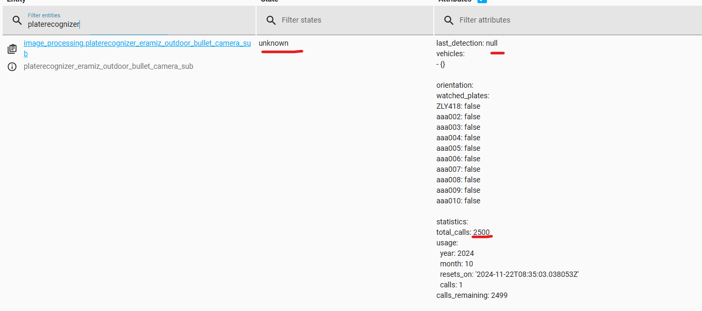

# License Plate Recognizer (LPR)

| Description          | Links                                                |
| -------------------- | ---------------------------------------------------- |
| Video Tutorial       | https://www.youtube.com/watch?v=t-XxCrdj_94          |
| Github Documentation | https://github.com/robmarkcole/HASS-plate-recognizer |

---

### Chapters:

- [Installation](###Installation)
- [Configuration.yaml](###Configuration.yaml for lpr)
- [Making a sensor out of Watched Plates](###Making a sensor out of Watched Plates)
- [How to use LPR](#How to use LPR for Testing)

---

#### Dependencies:

- [**HACS**](HACS.md)

---

### Installation

- First things first, create an [account](https://app.platerecognizer.com/) because we need the **API TOKEN**
- after creating an account, go to [this](https://app.platerecognizer.com/service/snapshot-cloud/dashboard/) and click on **settings** and you will see the **API Token**.

Now after getting the API token go to the Home Assistant site 

1. Go to **HACS** , **3 dots on upper right** , click **custom repositories**
2. add this repo `https://github.com/robmarkcole/HASS-plate-recognizer` as **Integration**
3. then search for **platerecognizer custom integration**

----

#### Configuration.yaml for LPR

> either use terminal or file explorer 🖥️

- Locate __configuration.yaml__ and add this exoid yaml for LPR:

```yaml
image_processing:
  - platform: platerecognizer
    api_token: your_API_TOKEN
    regions:
      - ph
    watched_plates:
      - kbw46ba
      - kfab726
    save_file_folder: /config/images/platerecognizer/
    save_timestamped_file: True
    always_save_latest_file: True
    mmc: True
    detection_rule: strict
    region: strict
    server: http://yoururl:8080/v1/plate-reader/

    source:
      - entity_id: camera.yours
```

Configuration variables:
- **api_key**: Your api key.
- **regions**: (Optional) A list of [regions/countries](http://docs.platerecognizer.com/?python#countries) to filter by. Note this may return fewer, but more specific predictions.
- **watched_plates**: (Optional) A list of number plates to watch for, which will identify a plate even if a couple of digits are incorrect in the prediction (fuzzy matching). If configured this adds an attribute to the entity with a boolean for each watched plate to indicate if it is detected.
- **save_file_folder**: (Optional) The folder to save processed images to. Note that folder path should be added to [whitelist_external_dirs](https://www.home-assistant.io/docs/configuration/basic/)
- **save_timestamped_file**: (Optional, default `False`, requires `save_file_folder` to be configured) Save the processed image with the time of detection in the filename.
- **always_save_latest_file**: (Optional, default `False`, requires `save_file_folder` to be configured) Always save the last processed image, no matter there were detections or not.
- **mmc**: (Optional, default `False`, requires a [paid plan](https://platerecognizer.com/pricing/) with the MMC (Make, Model, Colour) feature enabled.)  If enabled returns the orientation of the vehicle as a separate attribute containing Front/Rear/Unknown.
- **detection_rule**: (Optional) If set to `strict`, the license plates that are detected outside a vehicle will be discarded.
- **region**: (Optional) If set to `strict`, only accept the results that exactly match the templates of the specified region. For example, if the license plate of a region is 3 letters and 3 numbers, the value abc1234 will be discarded. For regions with vanity license plates (e.g. in us-ca), we do not recommend the use of Strict Mode. Otherwise, the engine will discard the vanity plates.
- **server**: (Optional, requires a [paid plan](https://platerecognizer.com/pricing/) Provide a local server address to use [On-Premise SDK](https://docs.platerecognizer.com/#on-premise-sdk)

----

### Making a Sensor out of Watched Plates

> important! for [Integration of LPR + Frigate](Integration of LPRFrigate.md)

```yaml
sensor:
  - platform: template
    sensors:
      plate_recognizer:
        friendly_name: "platenumber"
        value_template: "{{ state_attr('image_processing.platerecognizer_1', 'watched_plates').platenumber }}"
```


- this sensor will be seen as entity to used in frigate.

---

### How to use LPR for Testing

> This is for using the service.  

- Go to **Actions** and type **Image processing Scan** , **click it**
- **Choose entity** and find **platerecognizer ... **
- then click **Perform Action** 




> This is for observing the Plate recognizer Status

- Go to **Developers Tool > STATES> then filter entities** , type for **platerecognizer**

  


> 